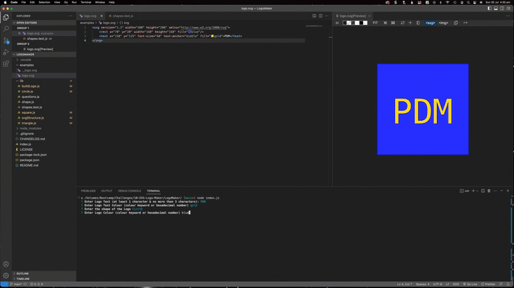

# SVG Logo Generator

## Description
This node.js application will build SVG Logos on demand. Logos can be in the shape of a circle, square or a triangle and contain between 1 and 3 characters of text. Logos and text can be of any CSS colour.

## Table of Contents
* [Video Demonstration](#video-demonstration)
* [Installation](#installation)
* [Usage](#usage)
* [License](#license)
* [Contributing](#contributing)
* [Tests](#tests)
* [Questions](#questions)

## Video Demonstration
Click the link to view the [Demonstration Video][def1]

## Installation
The SVG Logo Generator requires node.js & Inquirer v8.2.4 to be installed. The application also uses Jest v24.9.0 to confirm functionality. You can clone the package from the GitHub Repository. Install Inquirer & Jest by running npm install from the CLI.

## Usage
The Project is started from the CLI by running 'node index.js'. You will be prompted to answer a series of questions. The answers will be used to build the SVG Logo file (logo.svg) and save it in the examples folder.

## License
REAME Generator is available under the MIT License license. See the [LICENSE](https://opensource.org/licenses/MIT) file for more info.

## Contributing
Contributors are welcome. Feel free to clone or fork the project. Please let me know how you get on.

## Tests
Automated testing is provided to ensure the Logo Generator is working correctly. Jest v24.9.0 is used for testing. The test script is shapes.test.js located in the lib folder. shapes.test.js attempts to generate each of the 3 provided shapes (circle, square & triangle) and report success or any arrors. You can confirm functionality from the CLI using this command: 'npm run test'. 

## Questions
  
If you have questions about this project or would like more information you can [contact me by email](mailto:peter.medbury@dingogap.net.au).
  
You can see more of my work in my [Github Repository](https://github.com/dingogap).

## Resources Used
1. Bootcamp Materials - Lesson Material from Weeks 1 - 10
2. Prior knowledge and experience
3. [Inquirer.js][def2] Documentation
4. [Jest][def3] Documentation
5. [SVG Tutorial][def4] on MDM
6. [Node.js Exports Shortcut][def5] Documentation

[def1]: https://vimeo.com/849850517
[def2]: https://www.npmjs.com/package/inquirer
[def3]: https://jestjs.io/docs/29.4/getting-started
[def4]: https://developer.mozilla.org/en-US/docs/Web/SVG/Tutorial/Getting_Started
[def5]: https://nodejs.org/api/modules.html#exports-shortcut